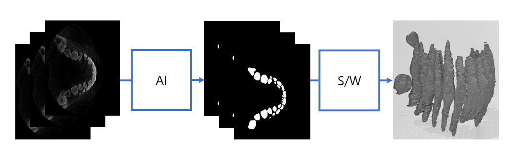

# Teeth Segmentation Project[Layer UNET]

## 배경

기존의 치과치료는 수동 계측을 통해 치아를 본뜨며 이를 교정, 임플란트 등에 활용한다. 이 경우 의사의 경험,능력에 따라 치료의 질이 달라진다. 또한 수동 계측을 하는 경우에 발생하는 추가적인 비용이 무시할 수 없는 수준이기 때문에 치료 비용이 증가하게 되고 이에 따라 치과 치료를 꺼리게 되는 경우가 많다.

## 목표

딥러닝을 활용해 3D CBCT 이미지에서 Z축의 수직으로 단면을 얻어내어 치아와 턱 뼈를 분리해 치아만을 추출하고, 이 결과를 활용해 3D STL로 모델링 하여 3D 프린터로 출력이 가능하도록 한다.

## Layer UNET 구조

DSV는 Deep Supervision을 의미함

|모델명|Train|Valid|Test|파라미터 수 (백만)|
|---|---|---|---|---|
|UNET3+|0.8399|0.7973|0.6877|7.6|
|UNET3+ DSV|0.8399|0.8415|0.7406|7.6|
|Layer UNET|0.8765|0.8240|0.7222|8.4|
|Layer UNET DSV|0.9091|0.8479|0.7744|8.4|
|Layer UNET DSV(2conv)|0.9177|0.8500|0.7888|10.0|

## 동작과정

1. 3D CBCT 이미지에 대해서 Z축을 기준으로 Slice하여 데이터셋을 구성한다.

2. 치아 이미지에 대해서 치아와 턱뼈를 분리해내고 치아만을 Segmentation하는 방법을 사용하였다.

3. 추론 결과를 Z축으로 다시 쌓아 3D STL 파일로 변환한다.

## 2022 전자전기공학회 추계학술제 발표

