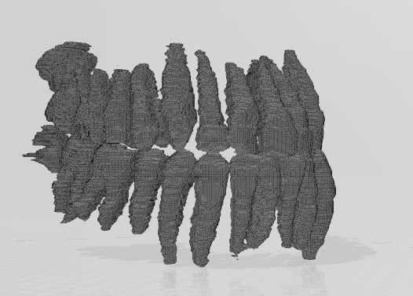
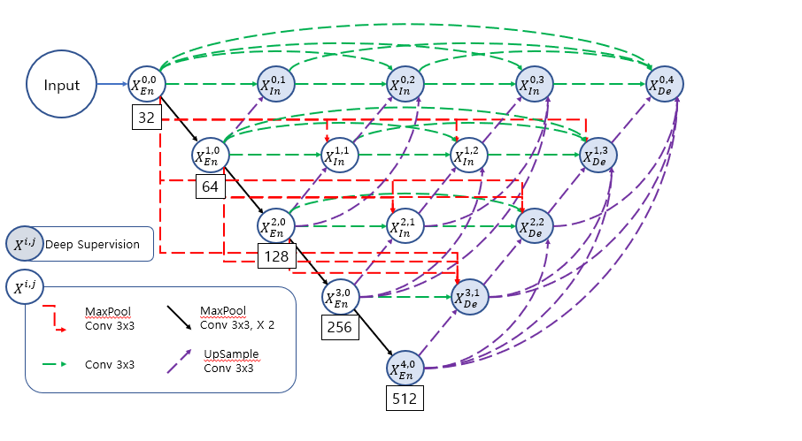
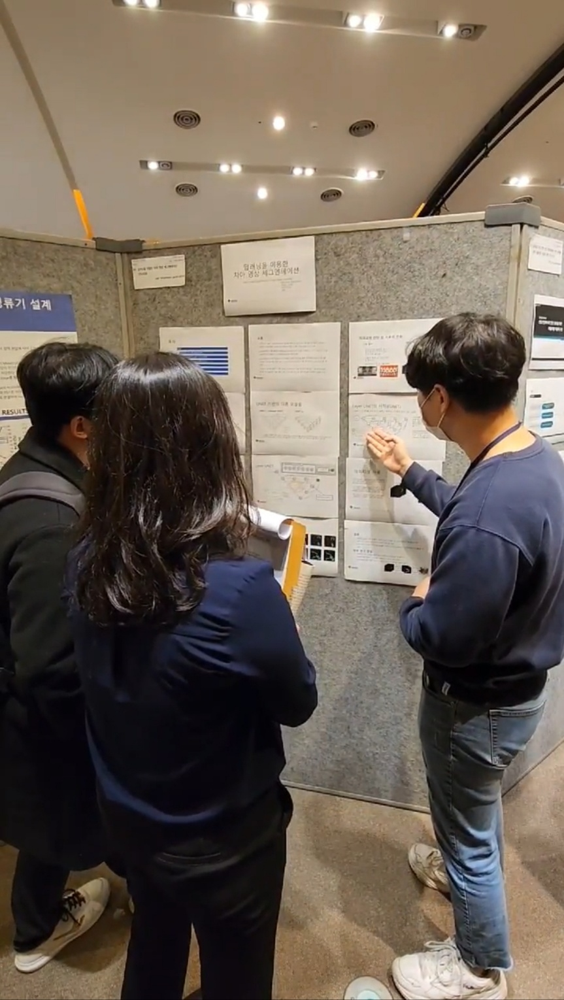

# Teeth Segmentation Project[Layer UNET]

## Layer UNET 구조

DSV는 Deep Supervision을 의미함

|모델명|Train|Valid|Test|파라미터 수 (백만)|
|---|---|---|---|---|
|UNET3+|0.8399|0.7973|0.6877|7.6|
|UNET3+ DSV|0.8399|0.8415|0.7406|7.6|
|Layer UNET|0.8765|0.8240|0.7222|8.4|
|Layer UNET DSV|0.9091|0.8479|0.7744|8.4|
|Layer UNET DSV(2conv)|0.9177|0.8500|0.7888|10.0|

## 동작과정

1. 3D CBCT 이미지에 대해서 Z축을 기준으로 Slice하여 데이터셋을 구성한다.

2. 치아 이미지에 대해서 치아와 턱뼈를 분리해내고 치아만을 Segmentation하는 방법을 사용하였다.

3. 추론 결과를 Z축으로 다시 쌓아 3D STL 파일로 변환한다.

