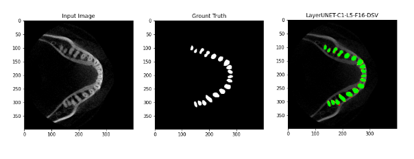

# Teeth Segmentation Project[Layer UNET]

|모델명|Train|Valid|Test|파라미터 수 (백만)|
|---|---|---|---|---|
|UNET3+|0.8399|0.7973|0.6877|7.6|
|UNET3+ DSV|0.8399|0.8415|0.7406|7.6|
|Layer UNET|0.8765|0.8240|0.7222|8.4|
|Layer UNET DSV|0.9091|0.8479|0.7744|8.4|
|Layer UNET DSV(2conv)|0.9177|0.8500|0.7888|10.0|

DSV는 Deep Supervision을 의미함

3D CBCT 이미지에 대해서 Z축을 기준으로 slice한 다음 각각의 이미지를 모델에 학습시키는 방법을 사용하였고

치아 이미지에 대해서 치아와 턱뼈를 분리해내고 치아만을 Segmentation하는 방법을 사용하였다.

위의 사진은 실제 치아를 분리하는 과정이며

아래와 같은 처리를 통해 3D STL파일로 변환한다.

